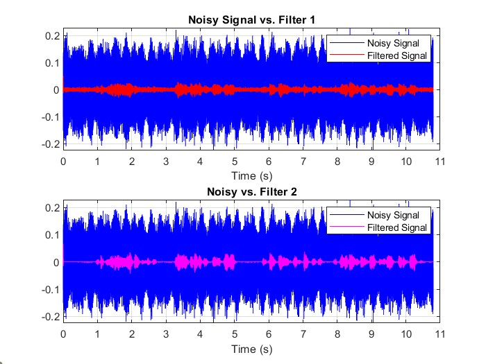
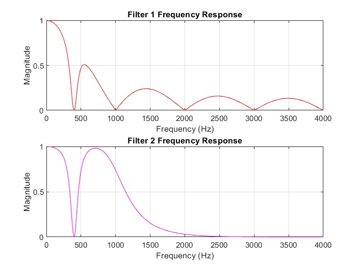
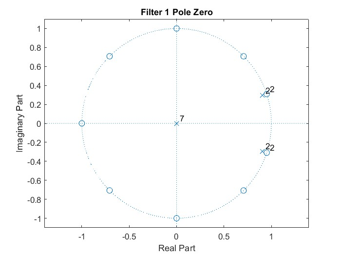

<h1>Noise Removal from Audio Signal</h1>
<h2>Overview</h2>

    In this project, I compared and evaluated the effectiveness of a lowpass Butterworth (filter #2) and a N-point moving average (filter #1) in removing high frequency noise from a audio signal.  
    Additionally, the audio signal contains a tonal noise at 400 Hz, which I nullified with a 4th order IIR notch filter.  

<h2>Results</h2>
The results from the butterworth filter yielded much better results. However other filters such as Chebeshev type II or elliptic filter may yield even better results due to a sharper transition band.

</img> 
</img> 
</img> 
